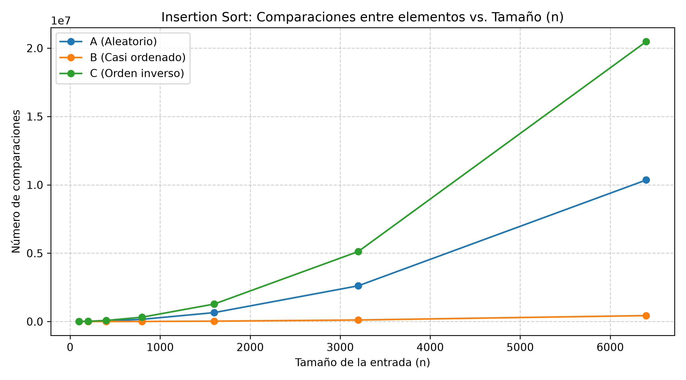
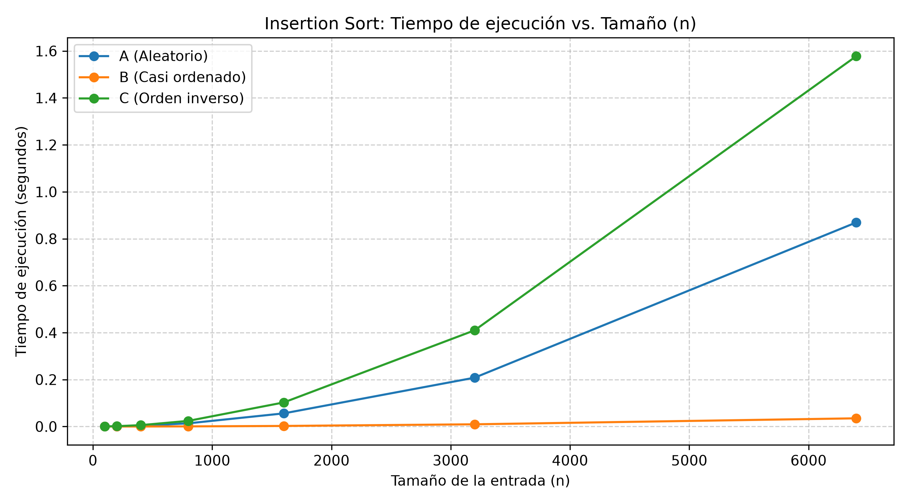
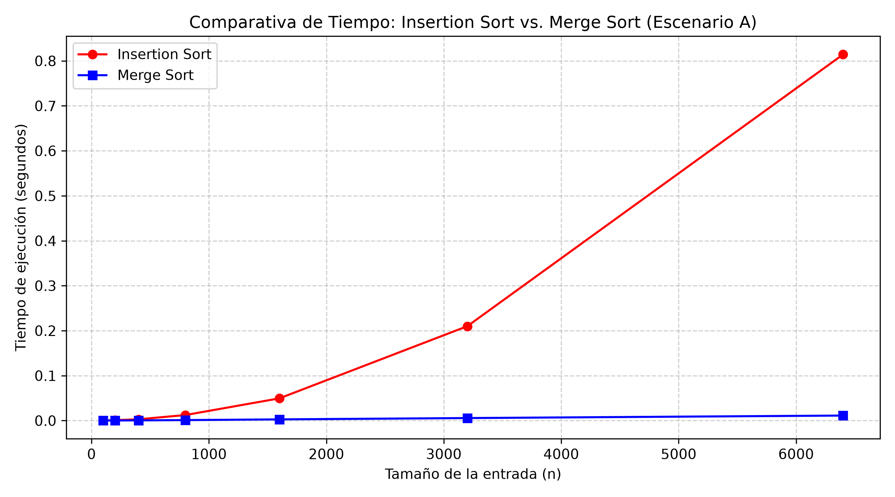

# Laboratorio 01 — Fundamentos, Complejidad y Recurrencias

**Estudiante:** Johan Sneider Garzón Salazar C.C. 1026162862
**Curso:** Análisis de Algoritmos

---

## Instrucciones para reproducir el experimento

1. Desde la raíz del repositorio (`curso-analisis-algoritmos/`), active el entorno virtual de Python:
   - **Windows (PowerShell):** `.\venv\Scripts\Activate.ps1`
   - **Linux / macOS / Git Bash:** `source venv/bin/activate`

2. Instale o verifique las dependencias:

   ```bash
   pip install -r requirements.txt
   ```
3. Ingrese a la carpeta del laboratorio:

   ```bash
   cd laboratorios/lab1-fundamentos-complejidad-recurrencias
   ```

4. Para ejecutar las pruebas de la Parte 3:

   ```bash
   python parte3_casos.py
   ```

5. Para ejecutar la comparación de la Parte 4:

   ```bash
   python parte4_complejidad.py
   ```

Las gráficas generadas deben quedar almacenadas en la carpeta `graficas/`.

---

## Parte 1 — Analizar el algoritmo antes de comprar hardware

Que un algoritmo entregue el resultado correcto no significa necesariamente que sea adecuado para usarlo en producción. En Tamiza, Insertion Sort sí ordena los registros de mayor a menor riesgo, por lo que cumple con su función. El problema aparece en el tiempo que necesita para hacerlo: actualmente se deben procesar 1.200.000 registros dentro de una ventana de cuatro horas, entre las 2:00 a. m. y las 6:00 a. m., y esa condición ya no se está cumpliendo.

Por eso considero que antes de comprar un servidor más rápido se debe revisar el algoritmo. Insertion Sort tiene un crecimiento cuadrático en el caso promedio y en el peor caso, es decir, Θ(n²). Tamiza pasó de manejar alrededor de 20.000 registros a 1.200.000, lo que significa que el tamaño de la entrada aumentó 60 veces. Con un algoritmo cuadrático, ese aumento puede representar aproximadamente 60² = 3.600 veces más trabajo. Duplicar la velocidad del servidor puede reducir un tiempo de ejecución, pero no cambia la forma en que crece el algoritmo cuando siguen aumentando los datos.

Un ejemplo similar puede darse en un catálogo de comercio electrónico. Supongamos que una búsqueda compara el texto ingresado por el usuario contra las descripciones de 40.000 productos mediante una búsqueda exhaustiva. El sistema puede encontrar correctamente los productos relacionados, pero si tarda varios segundos en responder, deja de ser útil para una aplicación web donde se espera una respuesta casi inmediata. En ese caso el problema no es que el resultado sea incorrecto, sino que llega demasiado tarde para la necesidad del sistema.

En conclusión, la compra de hardware puede mejorar temporalmente el tiempo de ejecución, pero primero debe revisarse si el algoritmo sigue siendo apropiado para el volumen actual y futuro de información.

---

## Parte 2 — Responsabilidad ambiental y ética de la implementación

### Dimensión ambiental

El tiempo de ejecución también tiene un impacto sobre los recursos utilizados por la infraestructura. Mientras más tiempo permanezca el servidor procesando los datos, más tiempo utiliza CPU, memoria y energía. Si esto ocurre una sola vez puede parecer poco importante, pero en Tamiza el proceso se ejecuta todas las madrugadas. Por lo tanto, una diferencia de horas de procesamiento se acumula durante semanas, meses y años.

Elegir un algoritmo que realice el mismo trabajo en menos tiempo ayuda a disminuir ese uso continuo de recursos. En este caso, no se trata solamente de comprar una máquina más potente, sino de evitar que el sistema tenga que realizar una cantidad de operaciones que crece demasiado rápido cuando aumenta el número de registros.

### Dimensión ética

La decisión también tiene consecuencias sobre personas reales. Si el proceso no termina antes de las 6:00 a. m., el centro de contacto puede empezar a trabajar con una lista incompleta o que todavía no está correctamente ordenada por nivel de riesgo.

Una primera consecuencia es para el **paciente**. Una persona con un nivel de riesgo alto podría quedar más abajo en la lista y ser contactada después de otras personas con menor prioridad. En este caso, el paciente es quien asume principalmente el costo del error porque se retrasa una atención que debía priorizarse.

Una segunda consecuencia es para los **operadores del centro de contacto**. Si reciben una lista incompleta o incorrectamente priorizada, deben trabajar con información que no refleja lo que el proceso debía entregar. Esto puede generar reprocesos, confusión y reclamos que realmente se originan en una falla previa del sistema.

También existe una responsabilidad para la Secretaría y para el equipo técnico, porque son quienes deben garantizar que el proceso utilizado sea confiable para el volumen de datos que maneja la plataforma.

En Tamiza, ordenar no es solamente organizar registros. El orden define a qué pacientes se contacta primero. Por eso, además de terminar a tiempo, el algoritmo debe conservar correctamente la prioridad de mayor a menor riesgo. Una falla en ese orden puede afectar directamente una decisión de atención.

---

## Parte 3 — Peor caso, mejor caso y caso promedio, demostrados en Python

*Código fuente relacionado:*

- [algoritmos.py](algoritmos.py)
- [datos.py](datos.py)
- [código de la Parte 3](parte3_casos.py)

### 3.1 — Explicación y predicciones

Para un mismo tamaño de entrada **n**, un algoritmo puede necesitar una cantidad diferente de operaciones dependiendo de cómo lleguen organizados los datos.

- **Peor caso:** corresponde a la entrada de tamaño n que hace que el algoritmo realice la mayor cantidad de trabajo posible.
- **Mejor caso:** corresponde a la entrada de tamaño n con la que el algoritmo necesita la menor cantidad de trabajo.
- **Caso promedio:** representa el comportamiento esperado al considerar las distintas formas en las que pueden llegar las entradas de ese mismo tamaño.

En Insertion Sort, cuando se ordena de mayor a menor, el mejor caso ocurre si la lista ya viene en ese mismo orden. En esa situación cada elemento prácticamente permanece en su posición y se realizan n − 1 comparaciones. El peor caso ocurre cuando la lista llega completamente al contrario, porque cada elemento debe desplazarse a través de gran parte de los elementos anteriores.

Para decidir si Tamiza puede entrar en producción usaría principalmente el **peor caso**. La razón es que la plataforma tiene una ventana máxima de cuatro horas y el canal de entrada puede cambiar. No sería suficiente que el proceso funcione bien solo cuando los datos llegan en condiciones favorables.

**Predicción antes de realizar las mediciones:**

- **Escenario C (orden inverso):** esperaba que fuera el peor de los tres escenarios porque los datos llegan exactamente al contrario del orden requerido.
- **Escenario B (casi ordenado):** esperaba que fuera el escenario más favorable, debido a que el 98 % del lote ya viene ordenado.
- **Escenario A (aleatorio):** esperaba que se aproximara al comportamiento promedio de Insertion Sort.

### 3.2 — Demostración experimental y gráficas





Los resultados obtenidos coinciden con la predicción general que se hizo antes de ejecutar las pruebas.

Para **n = 6.400**, el escenario C llegó a aproximadamente **20,48 millones de comparaciones**, siendo claramente el que más trabajo exigió. Ese resultado está muy cerca de n(n − 1) / 2 = 20.476.800, que es lo esperado para el peor caso de Insertion Sort.

El escenario A realizó aproximadamente **10,4 millones de comparaciones**, cerca de la mitad del escenario C. Esto concuerda con el comportamiento esperado para datos distribuidos aleatoriamente y permite tomarlo como una aproximación al caso promedio dentro del experimento.

El escenario B fue el que obtuvo los mejores resultados entre los tres escenarios probados, con alrededor de **410.000 comparaciones** para n = 6.400. Aunque es mucho menor que A y C, no es igual al mejor caso teórico de Insertion Sort, que sería n − 1 comparaciones. Esto tiene sentido porque todavía existe un 2 % de elementos agregados al final que deben buscar su posición dentro de la parte ya ordenada.

La gráfica de tiempo muestra el mismo comportamiento. Para n = 6.400, el escenario C tardó cerca de **1,58 segundos**, el escenario A alrededor de **0,87 segundos** y el escenario B aproximadamente **0,034 segundos**. Por lo tanto, las mediciones respaldan la predicción: C fue el escenario más costoso, B el más favorable de los escenarios de Tamiza y A quedó en un punto intermedio cercano al comportamiento promedio.

---

## Parte 4 — Complejidad de Merge Sort e Insertion Sort: cálculo y validación

*Código fuente relacionado:*

- [algoritmos.py](algoritmos.py)
- [código de la Parte 4](parte4_complejidad.py)

### 4.1 — Cálculo teórico

#### Recurrencia de Merge Sort

Merge Sort divide la lista en dos mitades, ordena cada mitad de forma recursiva y posteriormente mezcla los resultados. Por esta razón, su recurrencia puede escribirse como:

**T(n) = 2T(n/2) + Θ(n)**

En esta expresión:

- **2T(n/2)** representa los dos subproblemas que se generan, cada uno con la mitad de los elementos.
- **Θ(n)** representa el trabajo de mezclar las dos mitades, ya que durante esa operación se recorren los elementos para construir la lista ordenada.

Para resolver la recurrencia utilicé el **Método Maestro**.

La forma general es:

**T(n) = aT(n/b) + f(n)**

Para Merge Sort:

- a = 2, porque se generan dos subproblemas.
- b = 2, porque cada subproblema tiene la mitad del tamaño original.
- f(n) = Θ(n), porque la mezcla recorre linealmente los elementos.

El Método Maestro pide comparar f(n) con n elevado a log base b de a. En este caso, log₂(2) = 1, por lo que ese término es simplemente n. Como f(n) también crece linealmente, se cumple el caso 2 del Método Maestro.

El resultado es:

**T(n) = Θ(n log n)**

#### Conteo línea a línea de Insertion Sort en el peor caso

En el peor caso, cada elemento nuevo debe recorrer todos los elementos que ya fueron procesados. Tomando la estructura de la implementación de `insertion_sort`, el conteo queda así:

- La copia inicial de la lista se realiza una vez.
- El `for` recorre las posiciones desde 1 hasta n − 1, por lo que su cuerpo se ejecuta n − 1 veces.
- La asignación de la clave y la inicialización de `j` también se realizan n − 1 veces.
- En la iteración i, la comparación entre elementos del `while` puede ejecutarse i veces en el peor caso.
- El desplazamiento del elemento y el decremento de `j` se ejecutan la misma cantidad de veces que esas comparaciones exitosas.
- La asignación final de la clave se realiza una vez por cada iteración del `for`, es decir, n − 1 veces.

La cantidad de comparaciones entre elementos que domina el costo es entonces:

**1 + 2 + 3 + ... + (n − 1)**

La suma puede escribirse como:

**n(n − 1) / 2 = ½n² − ½n**

Cuando n aumenta, el término n² es el que más influye en el crecimiento. Por eso el peor caso de Insertion Sort es **Θ(n²)**.

#### Tabla de complejidades

| Algoritmo | Mejor caso | Caso promedio | Peor caso |
| :--- | :---: | :---: | :---: |
| **Insertion Sort** | Θ(n) | Θ(n²) | Θ(n²) |
| **Merge Sort** | Θ(n log n) | Θ(n log n) | Θ(n log n) |

---

### 4.2 — Validación experimental



La comparación se realizó usando el escenario A y los mismos tamaños utilizados en la Parte 3.

En la gráfica se observa que la diferencia entre los algoritmos aumenta a medida que crece la entrada. Para **n = 6.400**, Insertion Sort tardó aproximadamente **0,814 segundos**, mientras que Merge Sort tardó cerca de **0,011 segundos**.

La curva de Insertion Sort crece cada vez más rápido, mientras que la de Merge Sort permanece mucho más cerca del eje horizontal durante todo el experimento. Esto coincide con lo calculado en la Parte 4.1: Insertion Sort tiene crecimiento cuadrático en el caso promedio, mientras que Merge Sort mantiene un crecimiento de Θ(n log n).

En los tamaños pequeños la diferencia visual entre ambos algoritmos es reducida y puede verse afectada por el costo propio de las llamadas recursivas y de la creación de listas de Merge Sort. Sin embargo, al aumentar n la tendencia se vuelve clara y Merge Sort presenta un mejor comportamiento para el volumen de datos que necesita manejar Tamiza.

---

### 4.3 — Concepto técnico a la Secretaría de Salud

**Destinatario:** Dirección de Sistemas e Infraestructura — Secretaría de Salud Departamental  
**Asunto:** Concepto técnico sobre el ordenamiento nocturno de la Plataforma Tamiza

Después de revisar el comportamiento de Insertion Sort y compararlo con Merge Sort, recomiendo reemplazar el algoritmo actual por **Merge Sort** para el proceso nocturno de Tamiza. La principal razón es que el canal por el que llegan los registros puede cambiar y, por lo tanto, no es posible asumir que los datos siempre estarán casi ordenados. Mantener un solo algoritmo cuyo comportamiento sea estable frente a las distintas formas de entrada reduce ese riesgo.

Las mediciones realizadas muestran claramente la diferencia. En el escenario A, con **6.400 registros**, Insertion Sort tardó aproximadamente **0,814 segundos**, mientras que Merge Sort necesitó alrededor de **0,011 segundos**. Además, en la Parte 3 se observó que Insertion Sort llegó a **1,58 segundos** para la misma cantidad de registros cuando la entrada estaba en orden inverso. Esto es importante porque demuestra que el tiempo del algoritmo actual depende bastante de cómo lleguen los datos.

Para estimar qué podría ocurrir con los **1.200.000 registros** de Tamiza, tomé las mediciones anteriores como punto de partida. El aumento desde 6.400 hasta 1.200.000 registros corresponde a un factor de 187,5. Como Insertion Sort tiene crecimiento cuadrático, usando el dato del escenario A la estimación es de aproximadamente **28.617 segundos**, es decir, cerca de **7,95 horas**. Si se toma como referencia el escenario C, donde se midieron 1,58 segundos para 6.400 registros, la misma extrapolación da aproximadamente **15,43 horas**. Estas cifras son estimaciones basadas en las mediciones realizadas y no tiempos medidos directamente sobre 1.200.000 registros.

Para Merge Sort, partiendo de los **0,011 segundos** medidos con 6.400 registros y considerando su crecimiento n log n, la proyección es de aproximadamente **3,29 segundos** para 1.200.000 registros. Aunque en un ambiente real pueden aparecer otros costos de lectura, memoria o infraestructura, la diferencia de crecimiento entre ambos algoritmos es suficientemente grande para justificar el cambio.

Con estos resultados tampoco considero conveniente resolver el problema únicamente comprando un servidor del doble de velocidad. Incluso suponiendo, de forma favorable, que duplicar la capacidad redujera exactamente a la mitad el tiempo de cómputo, la estimación del escenario C pasaría de unas 15,43 horas a cerca de **7,7 horas**, todavía por encima de la ventana máxima de cuatro horas. El hardware puede ayudar, pero no corrige el crecimiento cuadrático del algoritmo actual.

Merge Sort sí necesita memoria adicional para realizar la mezcla de las listas, por lo que este aspecto debe tenerse en cuenta en la implementación. Aun así, para Tamiza considero que el costo adicional de memoria es un compromiso razonable frente a la mejora observada en tiempo y, sobre todo, frente a la necesidad de cumplir la ventana de procesamiento sin depender del orden en que lleguen los registros.

---