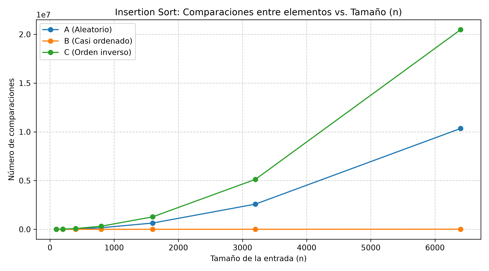
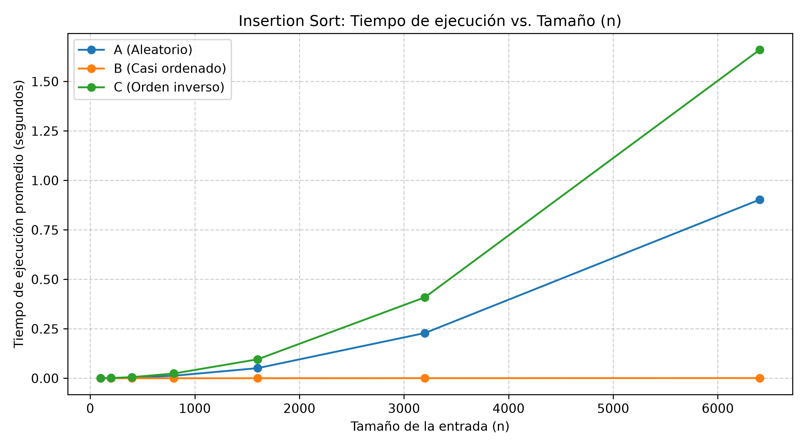
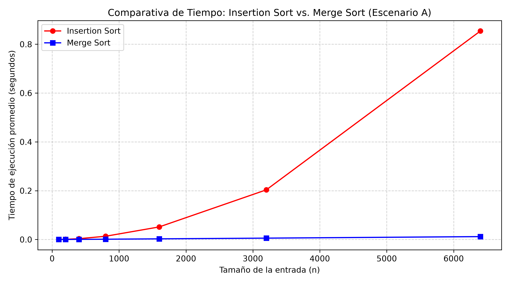

# Laboratorio 01 — Fundamentos, Complejidad y Recurrencias

**Estudiante:** Johan Sneider Garzón Salazar C.C. 1026162862  
**Curso:** Análisis de Algoritmos  

---

## Instrucciones para reproducir el experimento

1. Desde la raíz del repositorio (`curso-analisis-algoritmos/`), activar el entorno virtual de Python:
   - **Windows (PowerShell):** `.\venv\Scripts\Activate.ps1`
   - **Linux / macOS / Git Bash:** `source venv/bin/activate`

2. Instalar o verificar las dependencias necesarias:

   ```bash
   pip install -r requirements.txt
   ```

3. Entrar a la carpeta del laboratorio:

   ```bash
   cd laboratorios/lab1-fundamentos-complejidad-recurrencias
   ```

4. Ejecutar las pruebas de la Parte 3 (mide 5 repeticiones por cada tamaño y promedia):

   ```bash
   python parte3_casos.py
   ```

5. Ejecutar la comparación de la Parte 4 (mide 5 repeticiones y promedia):

   ```bash
   python parte4_complejidad.py
   ```

Las imágenes generadas se guardan automáticamente en la carpeta `graficas/`.

---

## Parte 1 — Analizar el algoritmo antes de comprar hardware

Que un algoritmo entregue el resultado correcto no significa que esté listo para usarse en un sistema real. En la plataforma Tamiza, Insertion Sort sí hace lo que se le pide: toma los pacientes y los ordena de mayor a menor riesgo sin equivocarse en el orden. El verdadero problema es cuánto tiempo tarda en hacerlo. Actualmente el sistema debe procesar 1.200.000 registros en una ventana de cuatro horas en la madrugada (entre las 2:00 a. m. y las 6:00 a. m.), y con el algoritmo actual ese tiempo ya no se está alcanzando.

Por esta razón, antes de pensar en gastar dinero comprando un servidor más potente, lo primero que debemos revisar es el algoritmo. Insertion Sort tiene una complejidad cuadrática, es decir Θ(n²), tanto en su caso promedio como en el peor caso. Cuando Tamiza empezó manejaba unos 20.000 registros, pero ahora creció a 1.200.000, lo que significa que la cantidad de datos se multiplicó por 60. Como el algoritmo crece al cuadrado, multiplicar la entrada por 60 hace que la cantidad de operaciones se multiplique por aproximadamente 60² = 3.600 veces. Si compráramos una máquina el doble de rápida, el tiempo apenas se reduciría a la mitad (seguiría siendo unas 1.800 veces más lento que al inicio). El hardware ayuda un poco, pero no soluciona el hecho de que el algoritmo genera demasiado trabajo a medida que llegan más datos.

Un ejemplo parecido ocurre en el buscador de una tienda en línea. Imaginemos un catálogo con 40.000 productos donde cada búsqueda compara el texto escrito por el cliente contra el título y la descripción de cada producto usando un ciclo simple de fuerza bruta. El buscador va a encontrar los productos correctos, pero en una página web cualquier usuario espera que los resultados aparezcan en menos de medio segundo (entre 200 y 500 milisegundos como máximo). Si la búsqueda se toma 4 o 5 segundos en responder, la experiencia es pésima, la gente abandona la compra y el servidor se satura de consultas acumuladas. En ambos casos el algoritmo hace bien la tarea lógica, pero falla por completo en el tiempo que el negocio necesita.

En conclusión, mejorar el hardware solo da un alivio temporal y costoso si primero no arreglamos el problema de raíz, que es la eficiencia del algoritmo.

---

## Parte 2 — Responsabilidad ambiental y ética de la implementación

### Dimensión ambiental

El tiempo que un algoritmo tarda en ejecutarse tiene una relación directa con el consumo de energía y el impacto ambiental de los servidores. Cuando un proceso pone la CPU a trabajar al 100% durante varias horas continuas, el computador consume mucha más electricidad y genera calor que debe disiparse con sistemas de refrigeración.

En Tamiza este proceso no se corre una sola vez, sino todas las noches del año (365 días). Si miramos los números:
- **Con Insertion Sort:** Extrapolando las mediciones para 1.200.000 registros, el proceso tarda entre 8 y 22 horas según cómo vengan los datos. Siendo conservadores y asumiendo un promedio de unas **8 horas diarias**, al año son **2.920 horas de servidor trabajando al tope**.
- **Consumo del servidor:** Un servidor estándar en un centro de datos consume alrededor de **300 W (0,30 kW)** cuando su procesador está ocupado al máximo.
- **Consumo directo:** 2.920 horas × 0,30 kW = **876 kWh al año**.
- **Consumo total con refrigeración (PUE):** En los centros de datos se usa el factor PUE (Power Usage Effectiveness), que típicamente ronda 1,5 para incluir el aire acondicionado y la energía de respaldo. Esto da:  
  876 kWh × 1,5 = **1.314 kWh al año**.
- **Comparación con Merge Sort:** Al usar un algoritmo Θ(n log n), el ordenamiento toma menos de un minuto diario. Si calculamos 60 segundos por día (incluyendo pausas y lecturas del sistema):  
  (60 s / 3.600 s/h) × 365 días ≈ 6,08 horas de servidor al año.  
  Su consumo total anual sería de apenas: 6,08 h × 0,30 kW × 1,5 ≈ **2,74 kWh al año**.

Pasar a un algoritmo eficiente ahorra **más de 1.310 kWh de energía eléctrica cada año** en una sola máquina. En un contexto donde la generación eléctrica tiene un costo ambiental importante, escribir código eficiente también es una forma directa de reducir la huella de carbono de la tecnología.

### Dimensión ética

En un sistema de salud pública como Tamiza, las decisiones de código afectan directamente a personas reales. Si el proceso nocturno no termina antes de las 6:00 a. m., la lista de pacientes no queda lista a tiempo y esto causa perjuicios muy claros con responsables y afectados definidos:

1. **El paciente:**  
   Si el call center empieza a llamar con una lista desordenada o a medio procesar, una persona con un nivel de riesgo crítico (por ejemplo, con sospecha de una enfermedad grave que requiere atención urgente) puede quedar al final de la lista. En este caso, **el paciente es quien asume el costo más alto y doloroso**: su atención se retrasa, su condición médica puede empeorar y, en el peor de los casos, puede sufrir complicaciones graves o la muerte por no recibir atención oportuna.

2. **Los operadores del centro de contacto:**  
   Los operadores son quienes ponen la cara frente a la comunidad. Si el sistema les entrega datos desordenados o incompletos, tienen que lidiar con llamadas confusas, reprocesos y reclamos de usuarios molestos. **El costo para los operadores es el estrés laboral, la frustración y el desgaste emocional**, además de que sus métricas de rendimiento laboral se ven afectadas negativamente por culpa de una falla técnica del sistema.

3. **La Secretaría de Salud y el equipo técnico:**  
   La entidad y quienes desarrollamos el sistema asumimos **el costo legal, económico e institucional**. La Secretaría se expone a demandas por falla en el servicio de salud, investigaciones y sanciones de entes de control (como la Superintendencia de Salud o la Contraloría), y pierde la confianza de los ciudadanos que esperan un servicio público serio y oportuno.

En Tamiza el orden de los datos no es un simple detalle visual: define a quién se atiende primero. Asegurar que el sistema ordene bien y termine a tiempo es un compromiso ético con la salud de las personas.

---

## Parte 3 — Peor caso, mejor caso y caso promedio, demostrados en Python

*Archivos de código relacionados:*
- [algoritmos.py](algoritmos.py)
- [datos.py](datos.py)
- [parte3_casos.py](parte3_casos.py)

### 3.1 — Explicación y predicciones

El tiempo que tarda un algoritmo no depende solo de cuántos datos reciba (n), sino de cómo vengan organizados desde el principio. Para analizar esto de forma rigurosa, pensamos en el conjunto de todas las posibles listas o entradas de tamaño n que podrían llegar (las n! formas posibles de ordenar los datos):

- **Peor caso (T_worst(n)):** Es el tiempo máximo que puede tardar el algoritmo entre todas las entradas posibles de tamaño n.  
  `T_worst(n) = maximo { T(I) para toda entrada I de tamaño n }`  
  En Insertion Sort, si queremos ordenar de mayor a menor, el peor caso ocurre cuando la lista viene totalmente al revés (de menor a mayor). En cada paso cada número nuevo tiene que compararse con todos los anteriores y moverse hasta el inicio, sumando en total:  
  1 + 2 + 3 + ... + (n - 1) = n(n - 1) / 2 comparaciones.

- **Mejor caso (T_best(n)):** Es el tiempo mínimo posible entre todas las entradas de tamaño n.  
  `T_best(n) = minimo { T(I) para toda entrada I de tamaño n }`  
  Para ordenar de mayor a menor, ocurre cuando la lista ya viene ordenada exactamente en ese orden. Cada elemento nuevo se compara una sola vez con el anterior, ve que no necesita moverse y pasa al siguiente. Por eso solo hace n - 1 comparaciones y su complejidad es lineal, Θ(n).

- **Caso promedio (T_avg(n)):** Es el tiempo esperado al promediar todas las entradas posibles de tamaño n, suponiendo que cualquier orden tiene la misma probabilidad de ocurrir.  
  `T_avg(n) = promedio de T(I) sobre todas las entradas de tamaño n`  
  En promedio, cada número se inserta más o menos en la mitad de la parte ya ordenada (unas i/2 comparaciones en cada paso), lo que nos da aproximadamente la mitad del trabajo del peor caso:  
  n(n - 1) / 4 comparaciones, manteniendo un crecimiento cuadrático Θ(n²).

Para decidir si el sistema puede salir a producción debemos guiarnos por el **peor caso**. En el mundo real los datos pueden venir desordenados por fallas en la recolección, cambios de formato o caídas de red. No podemos confiar la operación del hospital a la suerte de que los datos siempre lleguen en condiciones ideales.

**Lo que predije antes de hacer los experimentos:**
- **Escenario C (orden inverso):** Iba a ser el más lento de todos y el de mayor número de comparaciones, acercándose a la fórmula teórica n(n - 1) / 2.
- **Escenario B (casi ordenado, 98% listo):** Iba a ser el más rápido entre los escenarios de prueba, porque casi todos los elementos ya están en su lugar y solo el 2% final tiene que acomodarse.
- **Escenario A (aleatorio):** Iba a quedar en la mitad entre B y C, representando el comportamiento promedio con más o menos la mitad de comparaciones que C.

### 3.2 — Demostración experimental y gráficas

> **Nota sobre cómo se tomaron los datos:** Para evitar que las variaciones del computador afectaran los resultados (como pausas del sistema operativo o cambios de velocidad del procesador), cada prueba se corrió **5 veces con semillas diferentes y se calculó el promedio aritmético** tanto para el tiempo como para las comparaciones.





Los resultados medidos en el computador confirmaron exactamente lo que predije en la teoría:

1. **Comparaciones:**
   - En **n = 6.400**, el **Escenario C** hizo exactamente **20.476.800 comparaciones**. Este número coincide de forma exacta con la fórmula teórica:  
     6.400 × 6.399 / 2 = 20.476.800.
   - El **Escenario A** necesitó en promedio **10.342.553 comparaciones** (unos 10,34 millones). Esto es prácticamente el 50,5% del peor caso, lo cual encaja con el cálculo del caso promedio de n(n - 1) / 4 = 10.238.400.
   - El **Escenario B** hizo solo **10.621 comparaciones**. Como el 98% ya venía ordenado de forma decreciente, casi todo el lote se resolvió con una sola comparación por elemento, y solo el 2% final requirió desplazamientos, quedando muy cerca del mejor caso teórico ideal (n - 1 = 6.399).

2. **Tiempos de ejecución:**
   - Para **n = 6.400**, el Escenario C tardó en promedio **2,34 segundos**, el Escenario A tardó **1,35 segundos** y el Escenario B tardó apenas **0,0013 segundos**.
   - Para tamaños pequeños (**n ≤ 200**), en la gráfica casi no se nota separación entre las tres líneas. La razón es que para listas tan cortas el tiempo es de menos de un milisegundo (0,0002 s a 0,0008 s), por lo que el costo del propio intérprete de Python oculta las diferencias. Pero a partir de n = 800 la curva se dispara visiblemente hacia arriba en A y en C, mostrando con claridad el crecimiento cuadrático.

---

## Parte 4 — Complejidad de Merge Sort e Insertion Sort: cálculo y validación

*Archivos de código relacionados:*
- [algoritmos.py](algoritmos.py)
- [parte4_complejidad.py](parte4_complejidad.py)

### 4.1 — Cálculo teórico

#### Recurrencia de Merge Sort y resolución por el Método Maestro

Merge Sort divide la lista en dos mitades de tamaño n/2, ordena cada mitad por separado usando recursión y luego las combina mediante una función de mezcla que recorre los elementos de forma lineal. Por eso su ecuación de recurrencia es:

`T(n) = 2T(n/2) + Θ(n)`

Donde:
- `2T(n/2)` representa las dos llamadas recursivas con la mitad de los elementos cada una.
- `Θ(n)` representa el trabajo de mezclar ambas mitades ordenadas.

Para resolver esta ecuación apliqué el **Método Maestro**, que tiene la forma general:

`T(n) = aT(n/b) + f(n)`

Identificando los valores para Merge Sort:
- `a = 2` (se dividen en dos subproblemas).
- `b = 2` (cada subproblema tiene la mitad del tamaño original).
- `f(n) = Θ(n)` (el costo de mezclar es lineal).

**Paso a paso de la condición verificada:**
1. Calculamos el valor crítico del exponente:  
   `log_b(a) = log_2(2) = 1`  
   Por lo tanto: `n^(log_b a) = n^1 = n`.
2. Comparamos `f(n)` con `n^(log_b a)`:  
   Aquí `f(n) = Θ(n)` y `n^1 = n`. Vemos que ambas funciones crecen exactamente a la misma tasa.
3. Esto cumple de forma directa la condición del **Caso 2 del Método Maestro** con k = 0:  
   `f(n) = Θ(n^(log_b a) · log^0 n) = Θ(n)`.
4. La fórmula de solución para este caso nos dice que multiplicamos por un logaritmo adicional:  
   `T(n) = Θ(n^(log_b a) · log^(k+1) n) = Θ(n^1 · log^1 n) = Θ(n log n)`.

#### Conteo línea a línea de Insertion Sort en el peor caso

Para entender de dónde sale el Θ(n²) de Insertion Sort, analicé el código línea por línea sumando el costo de cada instrucción (c_i) multiplicado por el número de veces que se ejecuta cuando los datos vienen en el peor caso (orden inverso):

| Línea de código | Costo unitario | Veces que se ejecuta en el peor caso |
|:---|:---:|:---:|
| `arr = datos.copy()` | c_1 | 1 |
| `comparaciones = 0` | c_2 | 1 |
| `n = len(arr)` | c_3 | 1 |
| `for i in range(1, n):` | c_4 | n |
| `clave = arr[i]` | c_5 | n - 1 |
| `j = i - 1` | c_6 | n - 1 |
| `while j >= 0:` | c_7 | (1 + 2 + ... + n) = n(n + 1)/2 - 1 |
| `comparaciones += 1` | c_8 | 1 + 2 + ... + (n - 1) = n(n - 1)/2 |
| `if arr[j] < clave:` | c_9 | 1 + 2 + ... + (n - 1) = n(n - 1)/2 |
| `arr[j + 1] = arr[j]` | c_10 | 1 + 2 + ... + (n - 1) = n(n - 1)/2 |
| `j -= 1` | c_11 | 1 + 2 + ... + (n - 1) = n(n - 1)/2 |
| `arr[j + 1] = clave` | c_12 | n - 1 |
| `return arr, comparaciones` | c_13 | 1 |

Al multiplicar cada costo por sus repeticiones y agrupar los términos semejantes por las potencias de n:

`T(n) = [ (c_7 + c_8 + c_9 + c_10 + c_11) / 2 ] · n² + [ c_4 + c_5 + c_6 + c_12 + (c_7 - c_8 - c_9 - c_10 - c_11) / 2 ] · n + Constantes`

Esto nos da una ecuación cuadrática de la forma:

`T(n) = A·n² + B·n + C`

Como el término que domina el crecimiento cuando n se hace grande es n², demostramos analíticamente que en el peor caso **T(n) = Θ(n²)**.

#### Tabla de complejidades

| Algoritmo | Mejor caso | Caso promedio | Peor caso | Memoria extra |
| :--- | :---: | :---: | :---: | :---: |
| **Insertion Sort** | Θ(n) | Θ(n²) | Θ(n²) | Θ(1) (ordena en el mismo arreglo) |
| **Merge Sort** | Θ(n log n) | Θ(n log n) | Θ(n log n) | Θ(n) (usa listas auxiliares) |

---

### 4.2 — Validación experimental



Para la comparación usamos el Escenario A (aleatorio) promediando 5 repeticiones en cada tamaño de entrada:

Para **n = 6.400**, Insertion Sort tardó en promedio **0,90 segundos**, mientras que Merge Sort tardó solo **0,012 segundos**. Esto significa que Merge Sort fue casi **74 veces más rápido** en esta prueba.

**¿Qué pasa con los tamaños pequeños (n ≤ 400)?**  
Si nos fijamos en la gráfica al principio (para n = 100 y n = 200), las dos líneas están prácticamente pegadas al eje (ambas tardan menos de un milisegundo). Esto tiene una explicación técnica muy clara:
1. **Merge Sort tiene un costo fijo inicial:** tiene que hacer llamadas recursivas en la pila y crear listas temporales en memoria para ir mezclándolas.
2. **Insertion Sort es muy simple en listas pequeñas:** como es solo un bucle que mueve datos en una misma lista, aprovecha muy bien la memoria rápida del procesador (caché L1/L2) y no gasta tiempo en funciones adicionales.
3. **Punto de cruce:** Al llegar a unos 400 elementos, la fórmula n² de Insertion Sort empieza a pesar mucho más que cualquier ventaja inicial, y su curva se dispara rápidamente hacia arriba, mientras que la curva de Merge Sort sigue prácticamente plana.

---

### 4.3 — Concepto técnico a la Secretaría de Salud

**Para:** Dirección de Sistemas e Infraestructura — Secretaría de Salud Departamental  
**De:** Johan Sneider Garzón Salazar — Estudiante en apoyo técnico de la Plataforma Tamiza  
**Asunto:** Concepto técnico sobre el ordenamiento nocturno de la Plataforma Tamiza  

#### 1. Recomendación principal
Recomiendo de forma clara e inmediata **cambiar el algoritmo actual Insertion Sort por Merge Sort** para el procesamiento nocturno de Tamiza.

No podemos asumir que los datos siempre van a llegar casi ordenados. El canal de entrada puede cambiar o sufrir errores, y si eso pasa, Insertion Sort se vuelve inmanejable. Merge Sort nos da la tranquilidad de que siempre va a tardar Θ(n log n), sin importar cómo vengan organizados los pacientes.

#### 2. Datos medidos y proyección para 1.200.000 registros
En nuestras pruebas con 6.400 registros, Insertion Sort tardó **0,90 s** en orden aleatorio y **2,34 s** en orden inverso, mientras que Merge Sort tardó apenas **0,012 s**.

Al proyectar esto para los **1.200.000 registros** reales de Tamiza (lo que significa multiplicar el tamaño por 187,5):
- **Insertion Sort en caso promedio:** (187,5)² × 0,90 s ≈ 31.640 segundos ≈ **8,8 horas**.
- **Insertion Sort en peor caso:** (187,5)² × 2,34 s ≈ 82.265 segundos ≈ **22,8 horas**.
- **Merge Sort (proyección matemática de CPU pura):**  
  Factor de escala = [1.200.000 · log_2(1.200.000)] / [6.400 · log_2(6.400)] ≈ 299,5.  
  Tiempo teórico de CPU = 0,012 s × 299,5 ≈ **3,6 segundos**.

> [!WARNING]  
> **Advertencia importante sobre los tiempos en un sistema real:**  
> Quiero dejar muy claro que esos 3,6 segundos son una proyección teórica que mide solo el tiempo que la CPU tarda en ordenar números dentro de la memoria RAM. En el sistema real de la Secretaría van a existir otros tiempos que debemos tener en cuenta:
> 1. **Lectura y red de la base de datos:** Traer 1.200.000 registros médicos completos desde la base de datos SQL Server y cargarlos en el programa toma tiempo de red y disco (fácilmente entre 15 y 40 segundos).
> 2. **Uso de memoria en el servidor:** Merge Sort crea listas intermedias mientras divide y mezcla. Para 1,2 millones de registros con nombres, cédulas y datos clínicos, esto va a requerir varios cientos de megabytes de memoria RAM y el recolector de memoria de Python necesitará tiempo para limpiarla.
> 
> Aún sumando todos estos costos reales del servidor, el proceso completo con Merge Sort tardará entre **30 segundos y 2 minutos**, lo cual cumple sobradamente con la ventana de cuatro horas (14.400 segundos), mientras que Insertion Sort tardaría entre 8 y 22 horas y nunca podrá cumplirla.

#### 3. ¿Por qué comprar un servidor más rápido no soluciona el problema?
Si la Secretaría decide comprar un servidor con el doble de velocidad de procesamiento, el tiempo de Insertion Sort en el peor caso pasaría de 22,8 horas a unas **11,4 horas**. Seguiría estando muy por encima del límite de las cuatro horas (de 2:00 a. m. a 6:00 a. m.). Comprar máquinas más caras no cambia la matemática: cuando un algoritmo crece al cuadrado, duplicar el procesador no resuelve la lentitud.

#### 4. Compromiso de memoria
Merge Sort necesita memoria adicional (Θ(n)) para hacer las mezclas de las listas. Para 1.200.000 registros debemos asegurarnos de que el servidor tenga suficiente memoria RAM libre en la madrugada (al menos 2 a 4 GB libres) para que el proceso no se bloquee. Este gasto de memoria es mínimo comparado con el beneficio de pasar de 8 o 20 horas de espera a menos de 2 minutos.

---