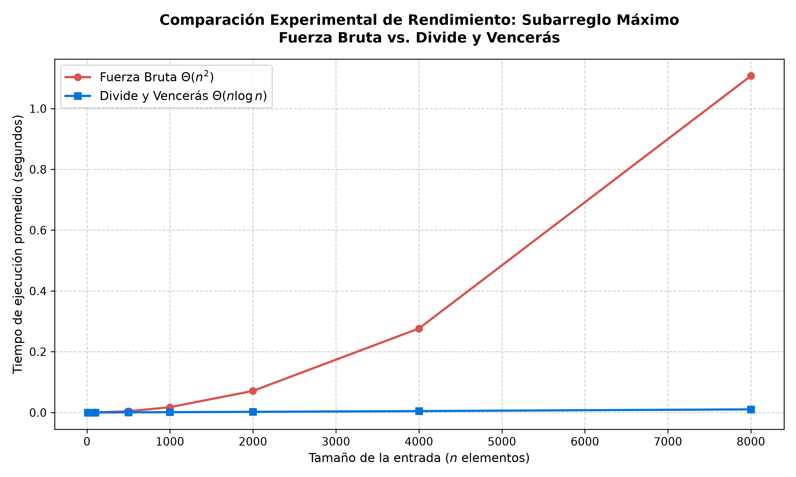

# Laboratorio 02 — Dividir y Vencer: Subarreglo de Suma Máxima

**Estudiante:** Johan Sneider Garzón Salazar  
**Curso:** Análisis de Algoritmos  

---

## Instrucciones para reproducir las pruebas y mediciones

Para clonar y reproducir los resultados obtenidos en este laboratorio:

1. Abrir la terminal en la raíz del repositorio (`curso-analisis-algoritmos/`) y activar el entorno virtual de Python:
   - **En Windows (PowerShell):**
     ```powershell
     .\venv\Scripts\Activate.ps1
     ```
   - **En Linux / macOS / Git Bash:**
     ```bash
     source venv/bin/activate
     ```

2. Entrar a la carpeta de este laboratorio:
   ```bash
   cd laboratorios/lab2-divide-y-vencer
   ```

3. Ejecutar las pruebas unitarias para validar que ambos algoritmos entregan los resultados correctos:
   ```bash
   python pruebas.py
   ```

4. Ejecutar el script experimental para medir los tiempos y volver a generar la gráfica:
   ```bash
   python medicion.py
   ```

La imagen con las curvas de rendimiento se guardará de forma automática en [graficas/tiempo_vs_n.png](graficas/tiempo_vs_n.png).

---

## Parte 1 — Implementación y Verificación

- Código fuente: [subarreglo.py](subarreglo.py)
- Pruebas con asertos: [pruebas.py](pruebas.py)

En [subarreglo.py](subarreglo.py) implementé los dos algoritmos solicitados siguiendo las pautas de clase y sin utilizar librerías externas para la lógica:
1. `subarreglo_fuerza_bruta`: Evalúa todas las parejas posibles $(i, j)$ llevando una suma acumulada en la variable `suma_actual`. Esto permite calcular cada subarreglo en tiempo constante dentro del ciclo, logrando una complejidad de $\Theta(n^2)$.
2. `subarreglo_maximo` y `suma_cruzada`: Resuelve el problema aplicando el paradigma de Divide y Vencerás. La función parte el arreglo por la mitad y resuelve recursivamente los casos izquierdo y derecho. Para el caso en que la mejor racha cruza el punto de división, apoya el cálculo en `suma_cruzada`, la cual hace dos recorridos lineales partiendo desde el medio hacia los extremos en tiempo $\Theta(n)$. Finalmente, compara los tres resultados y retorna el mejor, sin necesidad de recurrir a fuerza bruta en ningún momento.

Para asegurar que todo funcione como se espera, en [pruebas.py](pruebas.py) configuré un conjunto de pruebas con asertos (`assert`) que cubre:
- **La serie de 8 días de la cooperativa:** Con los valores `[-3, 5, -2, 8, -6, 3, 9, -4]`, verificando que ambos algoritmos encuentran la mejor racha entre los días 2 y 7 con una suma máxima de `17.0`.
- **Caso de un solo elemento:** Con `[42.0]`, retornando `(0, 0, 42.0)`.
- **Todos los valores negativos:** Con `[-15, -8, -23, -4, -12]`, retornando correctamente el elemento menos negativo (`-4.0`).
- **Todos los valores positivos:** Con `[5, 10, 15, 20, 25]`, retornando la suma de todo el arreglo (`75.0`).
- **Caso cruzado obligatorio:** Una lista diseñada especialmente para que la mejor racha cruce el punto medio.
- **50 listas aleatorias:** Generadas con tamaños y números al azar para comprobar que en todos los casos la suma máxima calculada por fuerza bruta coincide exactamente con la de divide y vencerás.

---

## Parte 2 — Medición y Gráfica

- Script de medición: [medicion.py](medicion.py)

Para comparar el rendimiento real frente a la teoría, en [medicion.py](medicion.py) medí los tiempos de ejecución para 8 tamaños distintos ($n \in \{10, 50, 100, 500, 1000, 2000, 4000, 8000\}$). 

Para mitigar el ruido que suele meter el sistema operativo en mediciones tan pequeñas, tomé tres precauciones:
1. Cronometré únicamente la llamada a la función con `time.perf_counter()`, dejando por fuera la creación de las listas.
2. Usé una semilla fija (`random.seed(42)`) para que cualquiera pueda reproducir exactamente los mismos datos.
3. Repetí cada prueba 5 veces independientes y calculé el promedio para cada tamaño. En cada repetición se validó con un `assert` que ambas soluciones dieran la misma suma.

### Tabla de tiempos medidos

| $n$ | Fuerza Bruta Promedio (s) | Divide y Vencerás Promedio (s) | Suma Validada |
|---:|:---:|:---:|:---:|
| 10 | 0.000004 | 0.000009 | 320.0 |
| 50 | 0.000043 | 0.000043 | 217.0 |
| 100 | 0.000169 | 0.000087 | 601.0 |
| 500 | 0.004253 | 0.000514 | 1556.0 |
| 1000 | 0.017447 | 0.001127 | 1059.0 |
| 2000 | 0.071112 | 0.002240 | 2146.0 |
| 4000 | 0.276486 | 0.004694 | 4674.0 |
| 8000 | 1.107603 | 0.010322 | 4353.0 |

### Gráfica comparativa



---

## Parte 3 — Análisis Teórico y Comparación

### 1. Recurrencia y complejidad teórica

Para Divide y Vencerás (`subarreglo_maximo`), la recurrencia es:
$$T(n) = 2T(n/2) + \Theta(n), \quad \text{para } n > 1; \quad T(1) = \Theta(1)$$
- $2T(n/2)$: parte el arreglo en dos mitades de tamaño $n/2$ y resuelve cada una recursivamente.
- $\Theta(n)$: trabajo de `suma_cruzada`, que barre linealmente desde el centro hacia los extremos sumando $n$ pasos.

Resolviendo por el Teorema Maestro ($a=2, b=2, f(n)=\Theta(n)$):
Como $\log_2 2 = 1 \implies n^1 = n$, la función $f(n) = \Theta(n)$ crece al mismo ritmo que $n^{\log_b a}$. Esto corresponde al **Caso 2**, concluyendo que $T(n) = \Theta(n \log n)$.

En fuerza bruta evaluamos todos los pares $(i, j)$ con $0 \le i \le j < n$. El total de pares es:
$$\sum_{i=0}^{n-1} (n - i) = \frac{n(n+1)}{2} = \Theta(n^2)$$
Al acumular la suma en cada paso en $O(1)$ sin reiniciar, el tiempo total es $\Theta(n^2)$.

### 2. Lo medido contra lo esperado

La gráfica confirma la teoría: la curva roja de fuerza bruta se dispara en parábola, mientras que divide y vencerás se mantiene casi horizontal.

Al duplicar el tamaño $n$:
- **Fuerza Bruta:** Al ser cuadrático, duplicar $n$ debería multiplicar el tiempo por 4. En nuestras pruebas, al pasar de $n = 2000$ a $n = 4000$, subió de $0.071112$ s a $0.276486$ s (factor $3.89 \approx 4$). Luego, de $n = 4000$ a $n = 8000$, subió a $1.107603$ s (factor $4.01 \approx 4$). Coincide con $\Theta(n^2)$.
- **Divide y Vencerás:** El factor teórico esperado al duplicar es $\frac{2n \log_2(2n)}{n \log_2 n} \approx 2.17$. En la práctica, de $n = 2000$ a $n = 4000$ subió de $0.002240$ s a $0.004694$ s (factor $2.10$), y a $n = 8000$ pasó a $0.010322$ s (factor $2.20$). Coincide con $\Theta(n \log n)$.

### 3. Tamaños pequeños

En tamaños pequeños sí vimos un punto de cruce (*crossover*). Con $n = 10$, fuerza bruta fue más rápida ($0.000004$ s frente a $0.000009$ s). Hacia $n = 50$ ambos empatan en $0.000043$ s, y desde $n = 100$ divide y vencerás toma una ventaja clara ($0.000087$ s vs $0.000169$ s) que ya no pierde.

Esto ocurre por las constantes ocultas de la recursión en Python: llamar funciones recursivas crea marcos en la pila y gestiona índices. Con apenas 10 elementos, ese costo administrativo pesa más que hacer pocas sumas en un ciclo simple. Pero a partir de $n \approx 50$, el orden cuadrático de la fuerza bruta supera esa sobrecarga.

### 4. ¿Cuándo conviene dividir?

Para hallar el máximo escalar de un arreglo, la recurrencia es $T(n) = 2T(n/2) + \Theta(1)$, lo que da $\Theta(n)$.

La diferencia clave está al combinar: en el máximo simple, combinar solo compara dos números ($\max(\text{izq}, \text{der})$), costando $\Theta(1)$. En el subarreglo máximo, la mejor racha puede cruzar el centro, por lo que `suma_cruzada` debe barrer linealmente ambos lados ($\Theta(n)$).

Dividir no mejora el problema del máximo porque cualquier algoritmo debe mirar los $n$ elementos al menos una vez ($\Omega(n)$); el recorrido secuencial ya es $\Theta(n)$ y dividir solo agrega sobrecarga recursiva. En cambio, en subarreglo máximo la solución directa toma $\Theta(n^2)$; aquí dividir sí aporta una mejora real porque baja la complejidad a $\Theta(n \log n)$ al resolver el cruce en un solo barrido por nivel.

### 5. Concepto para la gerente de la cooperativa

Recomiendo a la gerente implementar **Divide y Vencerás**.

Como **estimación** matemática basada en los datos medidos en $n = 8000$ (y no por regla de tres lineal, pues los algoritmos no crecen linealmente):
- **Fuerza Bruta:** Pasar de $8\,000$ a $1\,000\,000$ multiplica $n$ por $125$. Al ser $\Theta(n^2)$, el tiempo escala por $125^2 = 15\,625$. Con nuestro tiempo medido de $1.1076$ s:
  $$1.1076\text{ s} \times 15\,625 \approx 17\,306\text{ segundos} \approx 4.8\text{ horas}$$
- **Divide y Vencerás:** El factor de escala asintótico es $\frac{10^6 \log_2(10^6)}{8000 \log_2(8000)} \approx 192.15$. Con nuestro tiempo medido de $0.01032$ s:
  $$0.01032\text{ s} \times 192.15 \approx 1.98\text{ segundos}$$

Con 1.500 tiendas o sensores masivos, fuerza bruta tardaría horas por tienda, mientras que divide y vencerás responde en un par de segundos.
